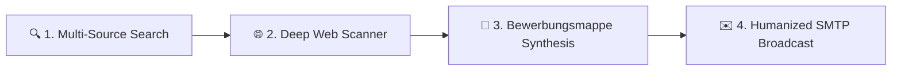

<p align="center">
  
</p>

<h1 align="center">ZUGZWANG &bull; LeadHunter Pro</h1>

<p align="center">
  <b>High-Performance Lead Generation, Automated Contact Enrichment & Smart Outreach Desktop Suite</b><br>
  <i>Engineered specifically for recruiters, staffing agencies, job seekers, and B2B sales teams in the DACH market.</i>
</p>

<p align="center">
  <a href="https://github.com/whbexc/Zugzwang/releases/latest"></a>
  
  
  
  
  
</p>

<p align="center">
  <a href="#-key-features">Features</a> &bull;
  <a href="#-supported-channels">Data Sources</a> &bull;
  <a href="#-downloads--installation">Downloads</a> &bull;
  <a href="#-interface-preview">Screenshots</a> &bull;
  <a href="#-developer-quickstart">Developer Setup</a> &bull;
  <a href="#-gmail--smtp-configuration">Outreach Setup</a> &bull;
  <a href="#-technical-architecture">Architecture</a>
</p>

---

## 💡 What is ZUGZWANG?

**ZUGZWANG** (derived from the chess term for being compelled to make a decisive move) is a unified desktop workstation that transforms tedious manual lead discovery and outreach into a streamlined, high-speed automated pipeline.

Instead of juggling scattered browser tabs, fragile scraping extensions, Excel sheets, and email drafts, ZUGZWANG unifies the entire workflow into a single, cohesive desktop interface:



1. **Target Discovery** &mdash; Scrapes live postings, companies, and apprenticeships across Germany's top commercial and employment registries.
2. **Automated Contact Enrichment** &mdash; Visits target websites, navigates *Impressum*, *Kontakt*, and *Karriere* pages to harvest verified HR emails, phone numbers, and decision-maker names.
3. **Application Synthesis (*Bewerbungsmappe*)** &mdash; Generates personalized, DIN 5008-compliant German cover letters, interactive certificate (*Zeugnisse*) bundles, and merges them with your CV into a single professional PDF package.
4. **Protected Outreach** &mdash; Dispatches personalized campaigns via your own Gmail or SMTP server with randomized human jitter delays (+5s to +18s), automated batch pauses, and anti-lockout safeguards.

---

## ⚡ Key Capabilities

### 🚀 High-Speed Scraping Architecture
- **In-Page `fetch()` Acceleration** &mdash; Executes network requests directly inside the active browser execution context, avoiding heavy tab rendering for up to **10x faster extraction** (~100ms per record).
- **Stealth & Resource Blocking** &mdash; Automatically aborts non-essential assets (images, web fonts, trackers) to save bandwidth and speed up page processing.
- **Smart Cookie Modal Bypasser** &mdash; 9-stage selector heuristics with automatic JavaScript execution and forced CSS suppression to handle GDPR cookie dialogs seamlessly.
- **Interactive Headed CAPTCHA Solver Bridge** &mdash; Launches an interactive headed browser when Cloudflare or security challenges occur, syncing authenticated cookies back to headless session workers automatically.

### 💼 Professional Application Package (*Bewerbungsmappe*)
- **DIN 5008-Aligned Generation** &mdash; Produces formal, German-standard business correspondence and cover letters with precise formatting.
- **Interactive Pro-Apple Zeugnisse Modal** &mdash; Modern drag-and-drop card interface for organizing diplomas, certificates, and work references with real-time PDF previews and instant ordering.
- **Dynamic PDF Stitcher** &mdash; Automatically merges cover letter, CV, and certificates into a single consolidated PDF attachment.

### ✉️ Safe & Humanized Outreach Engine
- **Jitter Intervals** &mdash; Configurable throttle profiles: Safe (30s), Normal (15s), Fast (5s), and Custom Jitter (+5s to +18s) to emulate natural human behavior.
- **Automatic Coffee Breaks** &mdash; Built-in pauses (e.g. 2.5 minutes every 12 emails) to comply with Gmail and enterprise SMTP rate restrictions.
- **Live Activity Streaming** &mdash; Real-time status console with visual state badges (`SENT`, `FAILED`, `WARNING`, `INFO`) and recipient re-ordering.
- **System WakeLock** &mdash; Prevents operating system sleep and idle timeouts during long scraping sessions and outreach queues.

### 🔒 100% Local, Private & Secure
- **Zero Cloud Dependence** &mdash; Data stays on your local machine in SQLite (`app_memory.db`). No third-party tracking, analytics, or telemetry.
- **Optional Startup PIN Lock** &mdash; Protect sensitive candidate databases and credentials with hardware-tied access encryption.

---

## 🌐 Supported Channels

| Source | Channel Type | Data Extracted | Engine |
|---|---|---|---|
| **Google Maps Places** | B2B & Commercial | Company name, category, address, phone, website, rating | Playwright Chromium |
| **Bundesagentur für Arbeit (BA)** | Official German Job Portal | Job title, company, location, requirements, direct contact email | API & Web Crawler |
| **Ausbildung.de** | Apprenticeship & Dual Study | Vocational roles, start dates, contact persons, HR email | In-page fetch() |
| **Aubi-Plus** | Trainee & Dual Studies | Premium apprenticeship listings, company profiles, contacts | In-page batching |
| **Azubiyo** | Apprenticeship Portal | Trainee postings, company credentials, application endpoints | Heuristic scraper |
| **Das Örtliche** | German Business Directory | Phone, street address, postal code, website, email | Direct DOM parser |
| **Custom Website Deep Scan** | Direct Web Crawler | Impressum, Kontakt, Karriere, social profiles, MX validity | Async Crawler |

---

## 📦 Downloads & Installation

Pre-compiled, standalone binaries are built automatically via **GitHub Actions** and hosted on the **[GitHub Releases](https://github.com/whbexc/Zugzwang/releases)** page:

| Operating System | Package | Installation Instructions |
|---|---|---|
| **🪟 Windows** | `ZUGZWANG_Setup_1.1.1.exe` | Run the installer wizard. Shortcuts are created automatically in your Start Menu. |
| **🍎 macOS** | `ZUGZWANG_macOS_1.1.1.zip` | Unzip, move `ZUGZWANG.app` to `/Applications`, and run the Gatekeeper command below. |
| **🐧 Linux** | `ZUGZWANG_Linux_1.1.1.tar.gz` | Extract archive, grant executable rights (`chmod +x ZUGZWANG`), and launch. |

> [!TIP]
> **macOS First Launch (Gatekeeper Quarantine Notice):**  
> Because the binary is self-packaged, macOS may flag it upon first launch. Open **Terminal** and execute:
> ```bash
> xattr -cr /Applications/ZUGZWANG.app
> ```

---

## 📸 Interface Preview

<div align="center">

### 1. Central Command Dashboard
*Real-time metrics, active scraping workers, and quick re-run history.*
<br><br>

<br><br>

### 2. Multi-Channel Target Generation
*Granular search targeting across cities, radius, offer types, and intelligent sources.*
<br><br>

<br><br>

### 3. Lead Intelligence & Data Export
*Comprehensive lead records with deep extraction, column filters, and Excel/CSV/PDF exports.*
<br><br>

<br><br>

### 4. Cover Letter & Bewerbungsmappe Editor
*DIN 5008 cover letter customization with live preview and certificate management.*
<br><br>

<br><br>

### 5. Safe Outreach & SMTP Broadcast Console
*Queue management, live activity telemetry, and automated delivery pacing.*
<br><br>

<br><br>

### 6. Live Scraper Monitor & Diagnostics
*Active session progress tracking, anomaly detection, and worker performance counters.*
<br><br>

<br><br>

### 7. Engine Preferences & System Settings
*Browser runtime configuration, proxy rotation, user agent pools, and security locks.*
<br><br>


</div>

---

## 💻 Developer Quickstart

To run or develop ZUGZWANG directly from source:

### Prerequisites
- **Python 3.11+** (tested through 3.14)
- **Git**

### Installation

```bash
# 1. Clone repository
git clone https://github.com/whbexc/Zugzwang.git
cd Zugzwang

# 2. Set up virtual environment
# macOS / Linux:
python3 -m venv .venv
source .venv/bin/activate

# Windows (PowerShell):
python -m venv .venv
.venv\Scripts\Activate.ps1

# 3. Install core dependencies
pip install -r requirements.txt

# 4. Install Playwright browser binaries
playwright install chromium

# 5. Launch ZUGZWANG
python main.py
```

> [!NOTE]  
> If using a dedicated virtual environment on macOS, run `.venv/bin/python -m playwright install` to guarantee browser binaries are linked directly to your active virtual environment.

---

## 📧 Gmail & SMTP Configuration

ZUGZWANG connects directly to your standard email provider via secure TLS/SSL. If using **Gmail**, an **App Password** is required:

1. Navigate to your **[Google Account Security Dashboard](https://myaccount.google.com/security)**.
2. Confirm **2-Step Verification** is enabled on your account.
3. Under *2-Step Verification*, scroll down to **App passwords** (or visit [myaccount.google.com/apppasswords](https://myaccount.google.com/apppasswords)).
4. Create an App Password with the name `ZUGZWANG`.
5. Copy the generated 16-character code.
6. Open **ZUGZWANG &rarr; Settings &rarr; Email Configuration** and enter:
   - **SMTP Host:** `smtp.gmail.com`
   - **SMTP Port:** `587` (STARTTLS) or `465` (SSL)
   - **Username:** `your-email@gmail.com`
   - **Password:** *[Your 16-character App Password]*

---

## 🏗️ Technical Architecture

<details>
<summary><b>Click to expand full repository map & design principles</b></summary>

### Architectural Layers
```
MainWindow (QFluentWindow)
├── Top Navigation Bar (Fluent Navigation)
├── QStackedWidget Container
│   ├── DashboardPage       (Session overview, stat counters, quick jobs)
│   ├── SearchPage          (Multi-channel intelligence input)
│   ├── StatisticsPage      (Full lead database, filters, detail drawer)
│   ├── MonitorPage         (Real-time worker telemetry & stream)
│   ├── SendPage            (SMTP broadcast queue & live status)
│   ├── SettingsPage        (Engine, network, proxy, security preferences)
│   └── LogsPage            (Filterable system trace logs)
├── ToastNotificationManager (Floating macOS physics-animated toast cards)
└── EventBus (Asynchronous cross-component pub/sub signal broker)
```

### Design Language & System Tokens
- **Design Standard:** macOS Obsidian 3.0 dark architecture.
- **Surface Elevation:** Base `#1C1C1E`, Surface Card `#2C2C2E`, Code/Log Panel `#1A1A1A`.
- **System Accent:** Apple System Blue (`#0A84FF`) with curated Status Emerald (`#30D158`), Amber (`#FF9F0A`), and Crimson (`#FF453A`).
- **Typography:** SF Pro Display / Text / Mono with customized high-DPI font rendering.

### Local Compilation & Continuous Integration
Continuous builds run on every tag release via `.github/workflows/build_releases.yml`. Local packagers are also available:
- `python build_with_browsers.py` &mdash; Bundles application with embedded Chromium assets.
- `scripts/build_macos.sh` &mdash; Creates standalone `.app` and `.zip` for macOS ARM64 / x86_64.
- `installer.iss` / `installer.nsi` &mdash; Compiles Windows installer wizard.

</details>

---

## ⌨️ Keyboard Shortcuts

| Shortcut | Action |
|---|---|
| <kbd>Ctrl</kbd> / <kbd>Cmd</kbd> + <kbd>1</kbd> &ndash; <kbd>6</kbd> | Switch between main navigation tabs |
| <kbd>Ctrl</kbd> / <kbd>Cmd</kbd> + <kbd>K</kbd> | Open Spotlight-style Universal Command Palette |
| <kbd>Ctrl</kbd> / <kbd>Cmd</kbd> + <kbd>N</kbd> | Start New Scraper Configuration |
| <kbd>Ctrl</kbd> / <kbd>Cmd</kbd> + <kbd>E</kbd> | Export Selected / Filtered Leads |
| <kbd>Ctrl</kbd> / <kbd>Cmd</kbd> + <kbd>F</kbd> | Focus Search Filter |
| <kbd>Ctrl</kbd> / <kbd>Cmd</kbd> + <kbd>R</kbd> | Re-run Last Saved Search Job |
| <kbd>Ctrl</kbd> / <kbd>Cmd</kbd> + <kbd>,</kbd> | Open Settings & Preferences |
| <kbd>Ctrl</kbd> / <kbd>Cmd</kbd> + <kbd>W</kbd> | Open "What's New" Release Changelog |
| <kbd>Esc</kbd> | Abort Active Job / Close Modal Drawer |

---

## 📄 License & Legal Notice

Copyright &copy; 2026 ZUGZWANG &bull; LeadHunter Pro. All rights reserved.

ZUGZWANG is a desktop automation and productivity utility designed for legitimate recruitment, career searching, and direct commercial contact management. Users are responsible for ensuring that all web scraping and outreach communications comply with applicable local laws and regulations, including the European Union General Data Protection Regulation (GDPR) and regional fair competition standards.
