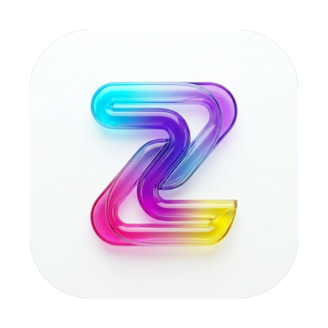
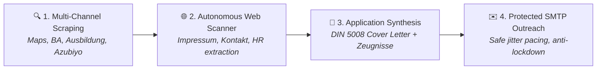
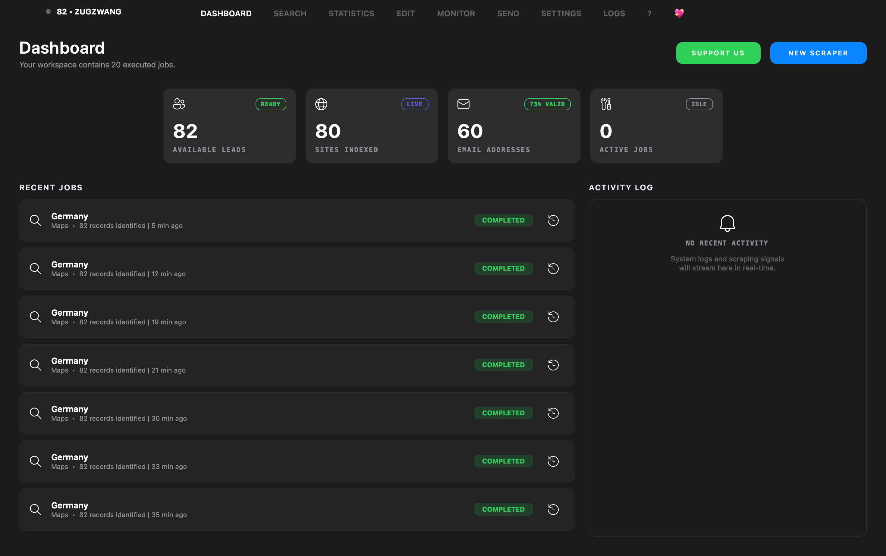
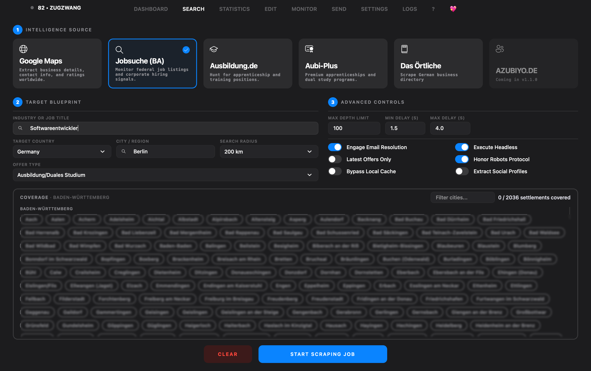
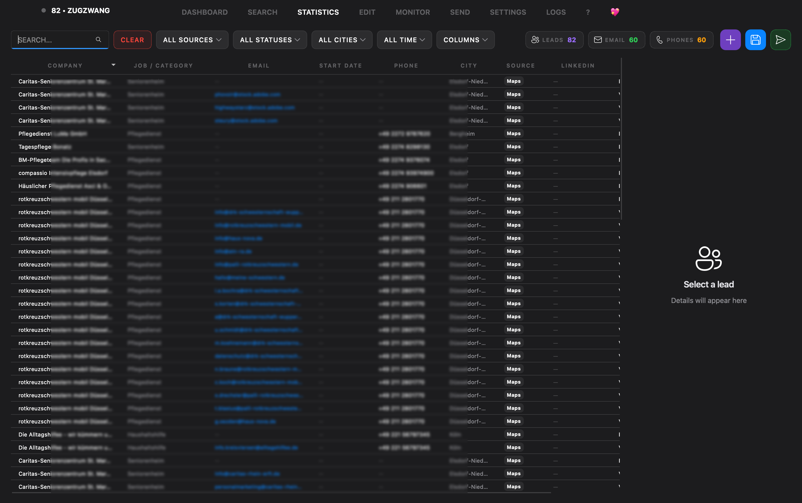
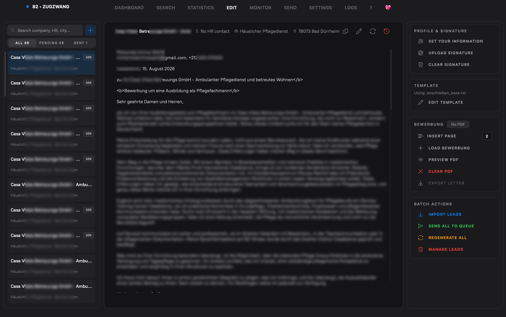
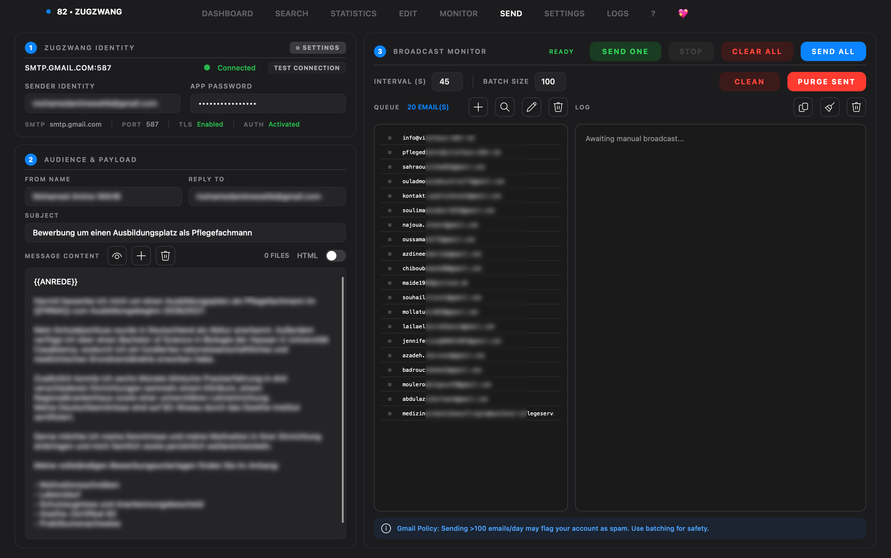
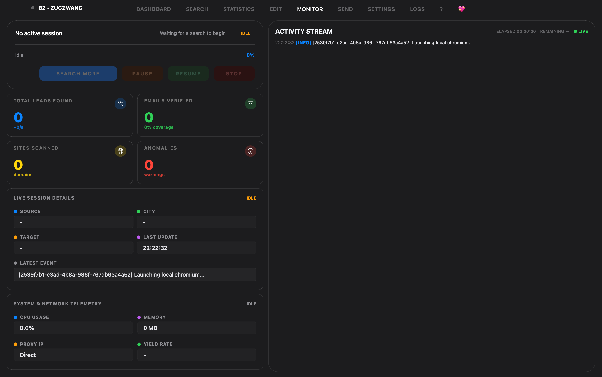
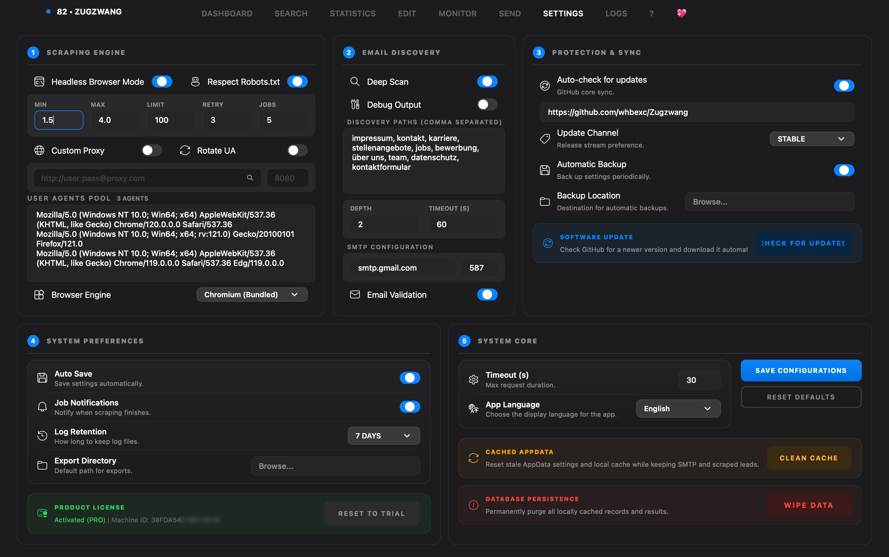

<p align="center">
  <a href="https://github.com/whbexc/Zugzwang">
    
  </a>
</p>

<h1 align="center">ZUGZWANG</h1>

<p align="center">
  <b>Lead Generation, Contact Enrichment & Safe Outreach Desktop Workstation</b><br>
  <sub>Cross-platform for macOS, Linux, and Windows &bull; Engineered for the German (DACH) Market</sub><br>
  <i>Empowering candidates, job seekers, and recruiters to cut out predatory middlemen and connect directly with German employers.</i>
</p>

<p align="center">
  <a href="https://github.com/whbexc"></a>
  <a href="https://github.com/whbexc/Zugzwang/releases/latest"></a>
  
  
  
  
</p>

<p align="center">
  <a href="https://github.com/whbexc/Zugzwang/releases/latest"><b>📥 Download Pre-built v1.1.2</b></a> &nbsp;&bull;&nbsp;
  <a href="#quick-start"><b>⚡ Quick Start</b></a> &nbsp;&bull;&nbsp;
  <a href="#email--smtp-configuration"><b>📧 Email Setup</b></a> &nbsp;&bull;&nbsp;
  <a href="#the-mission"><b>✊ The Mission</b></a> &nbsp;&bull;&nbsp;
  <a href="#why-zugzwang"><b>⚡ Why ZUGZWANG</b></a> &nbsp;&bull;&nbsp;
  <a href="#core-screens"><b>📸 Screenshots</b></a> &nbsp;&bull;&nbsp;
  <a href="#frequently-asked-questions"><b>❓ FAQ</b></a>
</p>

<p align="center">
  <code>🔍 Search</code> &nbsp;&bull;&nbsp;
  <code>⚡ Scrape</code> &nbsp;&bull;&nbsp;
  <code>🧠 Enrich</code> &nbsp;&bull;&nbsp;
  <code>📑 Review</code> &nbsp;&bull;&nbsp;
  <code>✉️ Send</code>
</p>

---

> [!IMPORTANT]
> ### 💬 A Note From WAHB:
> *"An **Ausbildung in Germany is 100% free** — in fact, the company is legally required to **pay YOU a monthly salary** (*Ausbildungsvergütung*) from your very first day.*  
> *You should **NEVER have to pay shady mediators, agencies, or brokers thousands of euros** just to get an interview or a contract. ZUGZWANG was born to destroy that predatory industry and put direct access back into the hands of ambitious candidates."*  
> &mdash; **WAHB**, Creator of ZUGZWANG

---

### 📊 At a Glance

| ⚡ 10x Speedup | 🇩🇪 6 Core DACH Portals | 📑 DIN 5008 Ready | 🔒 100% Free & Local |
|:---:|:---:|:---:|:---:|
| In-page `fetch()` engine skips DOM rendering for sub-100ms scraping | Ausbildung.de, Aubi-Plus, Azubiyo, BA Jobsuche, Maps, Das Örtliche | Automated cover letter, CV, and *Zeugnisse* PDF bundle merger | No cloud telemetry, no mediator fees, zero remote tracking |

---

## Table of Contents

| 🚀 Getting Started | ⚡ Features & Workflow | 🛠️ Reference & Project |
|:---|:---|:---|
| • [Overview](#overview)<br>• [The Mission](#the-mission)<br>• [Why ZUGZWANG](#why-zugzwang)<br>• [Quick Start](#quick-start)<br>• [Email & SMTP Setup](#email--smtp-configuration)<br>• [Build Commands](#build) | • [What It Does](#features)<br>• [Product Flow](#product-flow)<br>• [Core Screens](#screenshots)<br>• [Feature Snapshot](#feature-snapshot)<br>• [Keyboard Shortcuts](#keyboard-shortcuts) | • [Current Version (1.1.2)](#current-version)<br>• [Tech Stack](#tech-stack)<br>• [Project Structure](#project-structure)<br>• [Frequently Asked Questions](#frequently-asked-questions)<br>• [Roadmap Direction](#roadmap) |
| • [License (MIT)](#license)<br>• [Contributing](#contributing) | • [Data & Privacy](#data--privacy)<br>• [Development Notes](#development-notes) | • [Meet the Creator](#meet-the-creator)<br>• [Legal Disclaimer](#disclaimer) |

---

## Overview

ZUGZWANG is a PySide6 desktop application built for high-volume lead discovery and outbound workflow. It combines browser-based scraping, local lead persistence, enrichment, review, and SMTP outreach inside one interface.

It is designed for Ausbildung and job seekers, career coaches, and recruiters who need to find and reach out to employers at volume.

---

## The Mission

In chess, **Zugzwang** describes a position where every move forces the opponent into a decisive disadvantage. 

ZUGZWANG was created to confront a widespread issue affecting thousands of international applicants, young professionals, and job seekers:

### 🚫 The Predatory Middleman Trap
Across North Africa, Eastern Europe, and worldwide, unregulated "recruitment brokers" charge hopeful applicants **€2,000 to €8,000+** promising to "secure" them an apprenticeship or work contract in Germany.

**The reality they hide:**  
1. **Ausbildung is completely tuition-free.**  
2. **German companies pay you every single month** from Day 1 to learn and work.  
3. Thousands of German employers suffer from acute labor shortages (*Fachkräftemangel*) and **actively want to hire candidates directly**.

Brokers exploit applicants because navigating the German application ecosystem can be daunting: finding listings across fragmented portals, digging through complex legal *Impressum* pages for contact emails, properly formatting DIN 5008 cover letters, and managing mass email outreach safely.

### 🛡️ How ZUGZWANG Levels the Playing Field
**ZUGZWANG provides candidates and recruiters with an elite agency's complete toolkit for free:**
- Autonomously finds open positions and hiring companies across Germany's top portals.
- Visits company websites to extract verified HR decision-makers and direct contact emails.
- Formats DIN 5008-compliant cover letters and merges resumes and certificates (*Zeugnisse*) into a single application PDF.
- Dispatches personalized applications safely through your own email account with anti-ban jitter intervals and scheduled pauses.

**Cut out the middleman. Keep your hard-earned money. Apply directly and take control of your career.**

---

## Why ZUGZWANG

| Feature | Manual Work | Cloud SaaS (Apollo/Phantombuster) | **ZUGZWANG** |
|:---|:---:|:---:|:---:|
| **Specialized DACH Channels** (Ausbildung, Aubi-Plus, BA) | ❌ Slow & repetitive | ❌ Not Supported | **✅ Native Built-in** |
| **Deep *Impressum* & *Kontakt* Crawling** | ❌ Manual browsing | ⚠️ Limited / Extra Cost | **✅ Automated Heuristics** |
| **DIN 5008 German Cover Letter Synthesizer** | ❌ Manual Word Docs | ❌ None | **✅ Instant PDF Synthesis** |
| **Interactive *Zeugnisse* / Certificate Merger** | ❌ External PDF Editors | ❌ None | **✅ Drag-and-Drop Stitched PDF** |
| **Data Privacy (GDPR Compliance)** | ⚠️ Risk of Copy-Paste | ❌ Data stored on 3rd-party cloud | **✅ 100% Local Device SQLite** |
| **Monthly Subscription Costs** | 💸 Hours wasted | 💸 $50 - $200 / month | **🎉 100% Free & Open** |
| **Anti-Lockout Protection (Gmail / SMTP)** | ⚠️ Easy to trigger spam | ⚠️ Requires dedicated IP | **✅ Human Jitter + Coffee Breaks** |

---

<a id="features"></a>
## What It Does

### Multi-source scraping

- Google Maps business listings
- Bundesagentur für Arbeit (Jobsuche) job postings
- Ausbildung.de vocational listings
- Aubi-Plus apprenticeship vacancies
- Azubiyo dual study opportunities
- Das Örtliche regional business directory

### Lead enrichment

- Contact email extraction from target websites
- Automated discovery of Impressum, Kontakt, and Karriere pages
- Phone number formatting and normalization
- Street address, city, and postal code parsing
- Social media profile link detection

### Outreach workflow

- Native SMTP email sending
- Gmail-safe paced broadcast mode
- Recipient queue management with reordering
- Inline recipient queue editing
- Manual recipient entry dialog
- Duplicate-send prevention
- Message-sensitive resend tracking
- Application PDF attachment persistence
- Formatted HTML email preview
- Saved sender profiles with automatic field completion

### Local persistence

- Local SQLite application database
- Persistent search and query history
- Complete sent-email and outreach history
- Saved SMTP server credentials and sender profiles
- Stored file attachment configurations
- Clean local state refresh during version updates

---

## Product Flow

```text
Search -> Monitor -> Results -> Send
```



ZUGZWANG keeps that loop in one app instead of splitting it across separate scraper, spreadsheet, and mail tools.

---

<a id="screenshots"></a>
## Core Screens

### Dashboard
<p align="center">
  
</p>
<p align="center"><i>📊 <b>Central Dashboard:</b> Displays overall campaign progress, recent jobs, and active worker status so you can monitor your entire pipeline at a glance.</i></p>

### Search & Extract
<p align="center">
  
</p>
<p align="center"><i>🎯 <b>Multi-Portal Search:</b> Configure multi-source filters by job role, city, and catchment radius to harvest relevant leads automatically.</i></p>

### Persistent Lead Library
<p align="center">
  
</p>
<p align="center"><i>🗃️ <b>Lead Intelligence Table:</b> Organizes discovered leads with column visibility filters, completeness scores, and one-click exports to Excel or CSV.</i></p>

### Anschreiben Personalization
<p align="center">
  
</p>
<p align="center"><i>📑 <b>DIN 5008 Cover Letter Editor:</b> Generates customized German cover letters and merges them with your resume and certificates into a complete PDF package.</i></p>

### SMTP Outreach Workflow
<p align="center">
  
</p>
<p align="center"><i>✉️ <b>Outreach Console:</b> Manages your live recipient queue, dispatch intervals, and delivery activity streams to ensure controlled, safe email transmission.</i></p>

### Live Scraping Monitor
<p align="center">
  
</p>
<p align="center"><i>📡 <b>Real-Time Monitor:</b> Tracks active extraction progress, page metrics, and anomaly alerts in real time so you always know how your scrapers are performing.</i></p>

### Application Settings
<p align="center">
  
</p>
<p align="center"><i>⚙️ <b>Settings Manager:</b> Configures browser automation behaviors, network proxy routing, SMTP authentication, and security PIN options in one place.</i></p>

---

## Feature Snapshot

### Scraping engine

- Automated browser orchestration via Playwright
- Dedicated extraction modules tailored to each target platform
- Asynchronous background worker execution to maintain user interface responsiveness
- Interactive CAPTCHA handoff flow for challenge resolution
- Intelligent rate-limiting and browser session lifecycle management
- Direct fallback search mechanisms for standalone packaged environments

### Lead model

- Organization name and legal entity
- Industry category and job role title
- Validated primary and departmental contact emails
- Normalized telephone numbers
- Official company websites
- Street addresses, postal codes, and cities
- Source origin metadata and query timestamps

### Sending engine

- Standard SMTP transmission with full STARTTLS and SSL support
- Isolated fresh session delivery per individual recipient
- Paced sending protection featuring velocity limits, randomized jitter delays, and scheduled cooldown breaks
- Automatic backoff handling when SMTP servers report rate-limiting or temporary throttling codes
- Automated post-send disk cleanup that removes generated cover letters while preserving base resume templates
- Automatic connection recovery and retry handling on transient network failures
- Integrated test-email delivery and automated batch broadcast modes
- Comprehensive sent-message history and deduplication tracking
- Saved sender identity profiles with automated field completion
- Real-time recipient queue editing and manual contact creation
- Content-sensitive resend tracking that permits delivery when email text changes

### Storage model

- Local application configuration files in standard user data paths
- Embedded SQLite database for all lead records, queries, and session history
- Persistent lead deduplication based on stable entity identifiers
- Preserved file attachment locations and user preferences
- Non-destructive upgrade migrations that maintain existing lead data and license status

---

## Tech Stack

- Python 3.11+
- PySide6
- PyQt-Fluent-Widgets
- Playwright
- SQLite
- openpyxl
- httpx
- certifi

---

## Project Structure

```text
src/
  core/        models, config, security, events
  services/    scrapers, browser session, export/import, orchestrator
  ui/          pages, dialogs, theme, components
assets/        installer and branding assets
tests/         verification and regression tests
```

---

## Quick Start

### Standalone App Download (Recommended)

Download the latest standalone desktop release for your operating system from [GitHub Releases](https://github.com/whbexc/Zugzwang/releases):

- **🍎 macOS:** Download the `.zip` archive, extract it, and place `ZUGZWANG.app` in your `Downloads` or `Applications` folder.
  > [!IMPORTANT]
  > **macOS Gatekeeper Notice:** Because the macOS application bundle is ad-hoc signed, Gatekeeper may display an "app is damaged" warning or prevent launching. Run the following command in Terminal to clear the quarantine flag before opening:
  > ```bash
  > xattr -cr ~/Downloads/ZUGZWANG.app
  > ```
  > *(If placed in Applications, use `xattr -cr /Applications/ZUGZWANG.app` instead.)*

- **🪟 Windows:** Download and run `ZUGZWANG_Setup_x.x.x.exe`.
- **🐧 Linux:** Download the `.tar.gz` archive, extract, and execute `./ZUGZWANG`.

---

### Running from Source

#### Requirements
- Python 3.11+
- Operating System: **macOS 11+**, **Linux** (Ubuntu, Debian, Fedora, Arch), or **Windows 10/11**
- Chromium installed through Playwright

### Setup

#### 🍎 macOS (Apple Silicon & Intel)

```bash
# 1. Clone repository and enter directory
git clone https://github.com/whbexc/Zugzwang.git
cd Zugzwang

# 2. Create and activate Python virtual environment
python3 -m venv .venv
source .venv/bin/activate

# 3. Install dependencies & Playwright Chromium browser
pip install -r requirements.txt
playwright install chromium

# 4. Launch ZUGZWANG
python3 main.py
```

#### 🐧 Linux (Ubuntu, Debian, Fedora, Arch)

```bash
# 1. Clone repository and enter directory
git clone https://github.com/whbexc/Zugzwang.git
cd Zugzwang

# 2. Create and activate Python virtual environment
python3 -m venv .venv
source .venv/bin/activate

# 3. Install dependencies & Playwright Chromium browser (including OS dependencies)
pip install -r requirements.txt
playwright install --with-deps chromium

# 4. Launch ZUGZWANG
python3 main.py
```

#### 🪟 Windows (10 & 11)

```powershell
# 1. Clone repository and enter directory
git clone https://github.com/whbexc/Zugzwang.git
cd Zugzwang

# 2. Create and activate Python virtual environment
python -m venv .venv
.venv\Scripts\Activate.ps1

# 3. Install dependencies & Playwright Chromium browser
pip install -r requirements.txt
playwright install chromium

# 4. Launch ZUGZWANG
python main.py
```

---

<a id="email--smtp-configuration"></a>
## 📧 Email & SMTP Configuration

ZUGZWANG connects directly to your existing email provider via encrypted TLS/SSL to deliver personalized applications safely from your own address.

### 🔑 Gmail Setup (Recommended)

To send applications using your Gmail account, Google requires a 16-character **App Password**:

<table>
  <tr>
    <td width="33%" valign="top">
      <h4>1. Security Check 🔐</h4>
      <p>Go to your <a href="https://myaccount.google.com/security">Google Account Security</a> page and verify that <b>2-Step Verification</b> is turned <b>ON</b>.</p>
    </td>
    <td width="33%" valign="top">
      <h4>2. Generate App Password 🔑</h4>
      <p>Visit <a href="https://myaccount.google.com/apppasswords">Google App Passwords</a>, enter <code>ZUGZWANG</code> as the app name, and click <b>Generate</b>.</p>
    </td>
    <td width="33%" valign="top">
      <h4>3. Enter Credentials ⚙️</h4>
      <p>Copy the 16-character code into ZUGZWANG under <b>Settings &rarr; Email Configuration</b>.</p>
    </td>
  </tr>
</table>

### ⚙️ Popular Provider Settings Cheat Sheet

| Provider | SMTP Server Host | Port | Security / Encryption | Authentication |
|:---|:---|:---:|:---:|:---|
| **Google Gmail** | `smtp.gmail.com` | `587` or `465` | STARTTLS / SSL | Gmail Address + 16-character App Password |
| **Microsoft Outlook / Office 365** | `smtp-mail.outlook.com` | `587` | STARTTLS | Outlook Email + Account / App Password |
| **IONOS / 1&1 (Germany)** | `smtp.ionos.de` | `587` or `465` | STARTTLS / SSL | Full Email Address + Mail Password |
| **Strato (Germany)** | `smtp.strato.de` | `465` | SSL | Full Email Address + Mail Password |
| **Custom Corporate SMTP** | *mail.your-company.com* | `587` / `465` | STARTTLS / SSL | Mailbox Username + SMTP Password |

> [!TIP]
> **🛡️ Built-in Anti-Lockdown Protection:**  
> ZUGZWANG automatically enforces randomized human delays (**+5s to +18s jitter**) between individual emails and takes a **2.5-minute micro-break every 12 messages**. This mimics natural human behavior and keeps your email account completely safe from automated spam throttling.

---

## Build

### Build local bundle

```powershell
python build_with_browsers.py
```

### Build Windows installer

```powershell
iscc installer.iss
```

Legacy fallback:

```powershell
makensis installer.nsi
```

---

## Current Version

**1.1.2**

- Added an interactive CAPTCHA solver window that appears automatically when security challenges occur on Jobsuche or Google Maps so jobs never stall.
- Added a native certificate (*Zeugnisse*) management dialog to easily preview, reorder, and bundle your references into application packages.
- Upgraded Jobsuche and Google Maps scrapers to stream discovered leads into your results table in real time with higher reliability.
- Resolved background application stability issues on macOS Apple Silicon and Windows to ensure smooth long-duration scraping sessions.
- Redesigned status alerts with modern, floating macOS-style toast cards that keep you informed without interrupting your workflow.

See [CHANGELOG.md](CHANGELOG.md) for full release history.

---

## Keyboard Shortcuts

| Shortcut | Functionality |
|---|---|
| <kbd>Ctrl</kbd> / <kbd>Cmd</kbd> + <kbd>1</kbd> &ndash; <kbd>6</kbd> | Instant navigation between pages |
| <kbd>Ctrl</kbd> / <kbd>Cmd</kbd> + <kbd>K</kbd> | Spotlight Universal Command Palette |
| <kbd>Ctrl</kbd> / <kbd>Cmd</kbd> + <kbd>N</kbd> | Configure New Scraping Campaign |
| <kbd>Ctrl</kbd> / <kbd>Cmd</kbd> + <kbd>E</kbd> | Export Selected Table Records |
| <kbd>Ctrl</kbd> / <kbd>Cmd</kbd> + <kbd>F</kbd> | Focus Search & Filter Input |
| <kbd>Ctrl</kbd> / <kbd>Cmd</kbd> + <kbd>R</kbd> | Re-execute Last Active Scraping Blueprint |
| <kbd>Ctrl</kbd> / <kbd>Cmd</kbd> + <kbd>,</kbd> | Open System Settings & Preferences |
| <kbd>Ctrl</kbd> / <kbd>Cmd</kbd> + <kbd>W</kbd> | Open "What's New" Release Changelog |
| <kbd>Esc</kbd> | Cancel Active Task or Dismiss Modal Dialog |

---

## License

[](LICENSE)

This project is licensed under the MIT License - see the [LICENSE](LICENSE) file for details.

---

## Contributing

1. Fork the repository and create your feature branch (`git checkout -b feature/your-feature`).
2. Commit your changes with clear, descriptive commit messages (`git commit -m 'Add new feature'`).
3. Push your branch to GitHub and submit a Pull Request (`git push origin feature/your-feature`).

---

<a id="roadmap"></a>
## Roadmap Direction

High-value next additions:

- Project workspaces for managing distinct outreach campaigns
- Visual lead status pipeline with Kanban-style progress tracking
- Stronger search continuation across multiple interrupted sessions

---

## Frequently Asked Questions

<details>
<summary><b>1. Is my candidate data or scraped lead information stored in the cloud?</b></summary>
<br>
<b>No.</b> ZUGZWANG is 100% local software. All extracted leads, credentials, cover letter drafts, and logs are stored inside a local SQLite database (<code>app_memory.db</code>) on your own computer. No analytics, tracking, or cloud sync servers are utilized.
</details>

<details>
<summary><b>2. How does ZUGZWANG avoid getting banned or blocked by Google Maps & BA Jobsuche?</b></summary>
<br>
ZUGZWANG utilizes an in-page <code>fetch()</code> technique coupled with intelligent request throttling, human cursor jitter emulation, and the <b>Headed CAPTCHA Solver Bridge</b>. If a portal challenges the scraper with an interactive verification, a visual browser window seamlessly prompts the user to resolve it, instantly passes the authenticated session cookies back to the worker thread, and continues extraction without failing the job.
</details>

<details>
<summary><b>3. Can I send emails from non-Gmail providers (Outlook, IONOS, Strato, custom SMTP)?</b></summary>
<br>
<b>Yes.</b> ZUGZWANG supports standard SMTP with custom hostnames, ports (25, 465, 587), STARTTLS, and SSL. Simply input your provider's credentials under <b>Settings &rarr; Email Configuration</b>.
</details>

<details>
<summary><b>4. How are new versions built and released?</b></summary>
<br>
All production executables for macOS, Windows, and Linux are automatically built, validated, and signed through our continuous integration pipeline via <b>GitHub Actions</b> (<code>.github/workflows/build_releases.yml</code>) on every version tag.
</details>

---

## 👨‍💻 Meet the Creator

<p align="center">
  <b>Built with care, precision, and passion by WAHB</b><br>
  <i>Casablanca, Morocco 🇲🇦 &rarr; Crafted for users and professionals across Germany & the DACH region 🇩🇪</i>
</p>

<p align="center">
  <a href="https://github.com/whbexc"></a>
</p>

> 💡 **A quick note:** If ZUGZWANG helped you bypass greedy agencies, saved you thousands of euros, or helped you secure an Ausbildung/job directly, please consider giving the repository a **Star (⭐)** and sharing it with other ambitious candidates!
>
> Feel free to open an **[Issue](https://github.com/whbexc/Zugzwang/issues)** or start a **[Discussion](https://github.com/whbexc/Zugzwang/discussions)** if you have feature requests, suggestions, or want to contribute.

---

## Data & Privacy

ZUGZWANG stores local application state in AppData, including:

- settings
- logs
- screenshots
- app memory database

On version upgrades, the app can refresh stale cached local state once to avoid carrying old UI bugs forward. That reset is designed to preserve scraped leads, send-related state, outreach history, and Pro/license state.

You remain responsible for how scraped data and outbound email are used.

---

## Development Notes

This codebase is optimized around:

- non-blocking UI behavior
- background persistence
- source-specific scraper isolation
- Windows packaging and standalone distribution

Primary folders:

- `src/ui` for app pages and dialogs
- `src/services` for scraping and orchestration
- `src/core` for config, models, events, and security

---

## Disclaimer

Users are responsible for complying with:

- target platform terms
- anti-spam and outreach rules
- privacy and data protection law

---

<p align="center">
  <b>ZUGZWANG</b><br>
  Cross-platform desktop scraping and outreach, built for speed.
</p>

<!-- 1.1.2.2 -->
