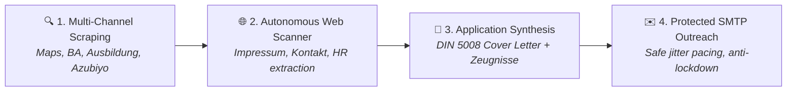

<p align="center">
  <a href="https://github.com/whbexc/Zugzwang">
    
  </a>
</p>

<h1 align="center">ZUGZWANG &bull; LeadHunter Pro</h1>

<p align="center">
  <b>The High-Performance Lead Discovery, Contact Enrichment & Outreach Desktop Workstation</b><br>
  <i>Tailor-made for recruiters, job seekers, career coaches, and sales teams targeting the German (DACH) market.</i>
</p>

<p align="center">
  <a href="https://github.com/whbexc"></a>
  <a href="https://github.com/whbexc/Zugzwang/releases/latest"></a>
  
  
  
  
  
</p>

<p align="center">
  <a href="https://github.com/whbexc/Zugzwang/releases/latest"><b>📥 Download Pre-built Binaries</b></a> &nbsp;&bull;&nbsp;
  <a href="#-the-story-behind-zugzwang"><b>📖 The Origin Story</b></a> &nbsp;&bull;&nbsp;
  <a href="#-feature-showcase"><b>✨ Feature Showcase</b></a> &nbsp;&bull;&nbsp;
  <a href="#-why-zugzwang"><b>⚡ Why ZUGZWANG</b></a> &nbsp;&bull;&nbsp;
  <a href="#-developer-setup"><b>💻 Developer Setup</b></a> &nbsp;&bull;&nbsp;
  <a href="#-meet-the-creator"><b>👨‍💻 Meet the Creator</b></a>
</p>

---

> [!NOTE]
> *"Software should feel like an extension of your mind — blazingly fast, entirely private, and unapologetically beautiful."*  
> &mdash; **WAHB**, Creator of ZUGZWANG

---

### 📊 At a Glance

| ⚡ 10x Speedup | 🇩🇪 6 Core DACH Portals | 📑 DIN 5008 Ready | 🔒 100% Local & Private |
|:---:|:---:|:---:|:---:|
| In-page `fetch()` engine skips DOM rendering for sub-100ms scraping | Ausbildung.de, Aubi-Plus, Azubiyo, BA Jobsuche, Maps, Das Örtliche | Automated cover letter, CV, and *Zeugnisse* PDF bundle merger | No cloud telemetry, no SaaS subscription, zero remote tracking |

---

## 📖 The Story Behind ZUGZWANG

In chess, **Zugzwang** describes a position where every possible move forces your opponent into a decisive disadvantage. 

I built **ZUGZWANG** because I witnessed firsthand how exhausting and soul-crushing the outreach process is in Germany:
- 😫 **The Manual Grind:** Searching across 5 different portals, opening 50 browser tabs, digging through dense legal *Impressum* pages to find an HR email, and manually copying everything into messy spreadsheets.
- 📑 **The Bureaucratic Burden:** Spending hours manually formatting DIN 5008 cover letters in Microsoft Word, aligning address blocks, and using clunky PDF tools to merge certificates (*Zeugnisse*) and CVs.
- 💸 **The SaaS Trap:** Being forced into $100/month cloud scraping subscriptions that upload your personal leads and confidential contact lists to third-party servers.

**ZUGZWANG turns the tables.** 

It is designed as an all-in-one, local desktop powerhouse that handles the heavy lifting &mdash; discovering high-value target companies, autonomously scraping verified decision-makers, stitching flawless German application packages (*Bewerbungsmappe*), and sending outreach through your own Gmail/SMTP account with anti-ban jitter protection.

No monthly bills. No data leaves your machine. Just pure, unadulterated speed and craftsmanship.



---

## ⚡ Why ZUGZWANG?

| Feature | Manual Work | Cloud SaaS (Apollo/Phantombuster) | **ZUGZWANG** |
|:---|:---:|:---:|:---:|
| **Specialized DACH Channels** (Ausbildung, Aubi-Plus, BA) | ❌ Slow & repetitive | ❌ Not Supported | **✅ Native Built-in** |
| **Deep *Impressum* & *Kontakt* Crawling** | ❌ Manual browsing | ⚠️ Limited / Extra Cost | **✅ Automated Heuristics** |
| **DIN 5008 German Cover Letter Synthesizer** | ❌ Manual Word Docs | ❌ None | **✅ Instant PDF Synthesis** |
| **Interactive *Zeugnisse* / Certificate Merger** | ❌ External PDF Editors | ❌ None | **✅ Drag-and-Drop Stitched PDF** |
| **Data Privacy (GDPR Compliance)** | ⚠️ Risk of Copy-Paste | ❌ Data stored on 3rd-party cloud | **✅ 100% Local Device SQLite** |
| **Monthly Subscription Costs** | 💸 Hours wasted | 💸 $50 - $200 / month | **🎉 100% Free & Open** |
| **Anti-Lockout Protection (Gmail / SMTP)** | ⚠️ Easy to trigger spam | ⚠️ Requires dedicated IP | **✅ Human Jitter + Coffee Breaks** |

---

## ✨ Feature Showcase

<table>
  <tr>
    <td width="50%" valign="top">
      <h3>1. Unified Multi-Source Intelligence</h3>
      <p>Harvest verified leads and vocational positions directly from Germany's primary employment and business hubs with fine-grained filters (city, radius, job role, and contract type).</p>
      <ul>
        <li><b>Bundesagentur für Arbeit (BA)</b> &mdash; Direct job portal synchronization.</li>
        <li><b>Ausbildung.de & Aubi-Plus</b> &mdash; Apprenticeship & dual study extraction.</li>
        <li><b>Azubiyo</b> &mdash; High-speed trainee role parser.</li>
        <li><b>Google Maps & Das Örtliche</b> &mdash; Regional B2B commercial discovery.</li>
      </ul>
    </td>
    <td width="50%" valign="top">
      
    </td>
  </tr>
  <tr>
    <td width="50%" valign="top">
      
    </td>
    <td width="50%" valign="top">
      <h3>2. Deep Contact Enrichment & Scoring</h3>
      <p>Raw company listings are automatically enriched by crawling the target's website, hunting for decision-maker data, and running sanity checks before outreach.</p>
      <ul>
        <li><b>Automated Crawler</b> &mdash; Discovers hidden <code>Impressum</code>, <code>Kontakt</code>, and <code>Karriere</code> sub-pages.</li>
        <li><b>Contact Extractor</b> &mdash; HR emails, phone numbers, postal addresses, and LinkedIn/Xing links.</li>
        <li><b>Lead Scoring (0-100)</b> &mdash; Evaluates data completeness so you prioritize high-probability leads.</li>
        <li><b>1-Click Export</b> &mdash; Export filtered subsets to Excel (<code>.xlsx</code>), CSV, JSON, or PDF.</li>
      </ul>
    </td>
  </tr>
  <tr>
    <td width="50%" valign="top">
      <h3>3. DIN 5008 <i>Bewerbungsmappe</i> Synthesizer</h3>
      <p>Generate clean, professional German job application documents without touching Microsoft Word or external PDF editors.</p>
      <ul>
        <li><b>DIN 5008 Alignment</b> &mdash; Proper margins, reference codes, subject lines, and sender headers.</li>
        <li><b>Pro-Apple Certificate Modal</b> &mdash; Drag-and-drop <i>Zeugnisse</i> reordering, live PDF preview, and instant document removal.</li>
        <li><b>Automated PDF Merge</b> &mdash; Stitches your custom cover letter, uploaded resume, and certificate bundle into a single ready-to-send PDF.</li>
      </ul>
    </td>
    <td width="50%" valign="top">
      
    </td>
  </tr>
  <tr>
    <td width="50%" valign="top">
      
    </td>
    <td width="50%" valign="top">
      <h3>4. Safe, Humanized Email Broadcast Engine</h3>
      <p>Send personalized emails safely through your own Gmail or corporate SMTP account without triggering spam filters or account locks.</p>
      <ul>
        <li><b>Human Jitter Intervals</b> &mdash; Randomized delays (+5s to +18s) to mimic natural manual sending.</li>
        <li><b>Batch Coffee Breaks</b> &mdash; Automatically pauses (e.g. 2.5 minutes every 12 emails) to obey provider hourly quotas.</li>
        <li><b>Live Telemetry Console</b> &mdash; Visual real-time badges (<code>SENT</code>, <code>FAILED</code>, <code>WARNING</code>) with error diagnostics.</li>
        <li><b>Drag-and-Drop Queue</b> &mdash; Easily reorder recipients or remove contacts on the fly.</li>
      </ul>
    </td>
  </tr>
  <tr>
    <td width="50%" valign="top">
      <h3>5. Real-Time Monitor & Anomaly Diagnostics</h3>
      <p>Keep complete visibility over active scraping sessions with live progress telemetry and system protections.</p>
      <ul>
        <li><b>Headed CAPTCHA Solver Bridge</b> &mdash; Automatically brings up an interactive headed browser when Cloudflare or security challenges occur, syncing authenticated cookies back to headless workers.</li>
        <li><b>Operating System WakeLock</b> &mdash; Prevents macOS and Windows from going into sleep mode during long extraction jobs.</li>
        <li><b>Smart In-Page Fetch</b> &mdash; Evaluates requests inside the target tab to bypass CORS and render 10x faster.</li>
      </ul>
    </td>
    <td width="50%" valign="top">
      
    </td>
  </tr>
</table>

---

## 🎨 Craftsmanship & Design Philosophy: Obsidian Core 3.0

ZUGZWANG was designed from the ground up with the premise that desktop tools should feel **tactile, responsive, and cinematic**.

- 🍏 **Senior-Grade macOS Aesthetics:** Hand-crafted palette featuring Deep Obsidian (`#1C1C1E`), elevated surface contrast (`#2C2C2E`), and Apple System Blue (`#0A84FF`) accents.
- ⚡ **Zero-Lag Architecture:** Non-blocking async event bus with zero GUI stutter even when processing hundreds of simultaneous network streams.
- 🔔 **Physics-Based Floating Toasts:** Bespoke macOS toast notifications with fluid spring animations, category-colored badges, and top-right window anchoring.
- ⌨️ **Keyboard-First Navigation:** Built-in Spotlight-style command palette (<kbd>Cmd/Ctrl</kbd> + <kbd>K</kbd>) to search leads, execute commands, and navigate without lifting your hands from the keyboard.

---

## 📦 Downloads & Installation

Download the official pre-compiled standalone releases from **[GitHub Releases](https://github.com/whbexc/Zugzwang/releases/latest)**:

| Platform | Format | Architecture | Installation Steps |
|:---|:---:|:---:|:---|
| **🪟 Windows** | `.exe` | x86_64 / x64 | Download `ZUGZWANG_Setup_1.1.1.exe` and follow the setup wizard. |
| **🍎 macOS** | `.zip` / `.app` | Apple Silicon (ARM64) & Intel | Download `ZUGZWANG_macOS_1.1.1.zip`, unzip, and drag to `/Applications`. Run the Gatekeeper command below. |
| **🐧 Linux** | `.tar.gz` | x86_64 | Download `ZUGZWANG_Linux_1.1.1.tar.gz`, unpack, and run `./ZUGZWANG`. |

> [!TIP]
> **🍎 macOS Gatekeeper Notice (Required for First Launch):**  
> Because ZUGZWANG is an independently built application, macOS Gatekeeper may prompt you on first launch. Open **Terminal** and run:
> ```bash
> xattr -cr /Applications/ZUGZWANG.app
> ```

---

## 💻 Developer Setup

If you prefer building or running ZUGZWANG directly from source:

### Prerequisites
- **Python 3.11** or higher (tested through **Python 3.14**)
- **Git**

```bash
# 1. Clone the repository
git clone https://github.com/whbexc/Zugzwang.git
cd Zugzwang

# 2. Initialize and activate a virtual environment
# On macOS / Linux:
python3 -m venv .venv
source .venv/bin/activate

# On Windows (PowerShell):
python -m venv .venv
.venv\Scripts\Activate.ps1

# 3. Install required Python packages
pip install -r requirements.txt

# 4. Install Playwright browser dependencies
playwright install chromium

# 5. Launch the application
python main.py
```

> [!NOTE]  
> If using a dedicated virtual environment on macOS, run `.venv/bin/python -m playwright install chromium` to guarantee browser binaries are installed directly into your local environment cache.

---

## 📧 Gmail & SMTP Configuration

To send outreach emails directly through your personal or workspace Gmail:

1. Visit your **[Google Account Security Dashboard](https://myaccount.google.com/security)**.
2. Verify that **2-Step Verification** is turned **ON**.
3. Search for **App passwords** (or go directly to [myaccount.google.com/apppasswords](https://myaccount.google.com/apppasswords)).
4. Create an App Password with the app name `ZUGZWANG`.
5. Copy the 16-character generated code (e.g. `abcd efgh ijkl mnop`).
6. In ZUGZWANG, open **Settings &rarr; Email Configuration** and configure:
   - **SMTP Server:** `smtp.gmail.com`
   - **SMTP Port:** `587` (STARTTLS) or `465` (SSL)
   - **Username / Sender:** `your-email@gmail.com`
   - **Password:** *[Your 16-character App Password]*

---

## ⌨️ Productivity & Keyboard Shortcuts

| Shortcut | Functionality |
|---|---|
| <kbd>Ctrl</kbd> / <kbd>Cmd</kbd> + <kbd>1</kbd> &ndash; <kbd>6</kbd> | Instant navigation between pages |
| <kbd>Ctrl</kbd> / <kbd>Cmd</kbd> + <kbd>K</kbd> | Spotlight Universal Command Palette |
| <kbd>Ctrl</kbd> / <kbd>Cmd</kbd> + <kbd>N</kbd> | Configure New Scraping Campaign |
| <kbd>Ctrl</kbd> / <kbd>Cmd</kbd> + <kbd>E</kbd> | Export Selected Table Records |
| <kbd>Ctrl</kbd> / <kbd>Cmd</kbd> + <kbd>F</kbd> | Focus Search & Filter Input |
| <kbd>Ctrl</kbd> / <kbd>Cmd</kbd> + <kbd>R</kbd> | Re-execute Last Active Scraping Blueprint |
| <kbd>Ctrl</kbd> / <kbd>Cmd</kbd> + <kbd>,</kbd> | Open System Settings & Preferences |
| <kbd>Ctrl</kbd> / <kbd>Cmd</kbd> + <kbd>W</kbd> | Open "What's New" Release Changelog |
| <kbd>Esc</kbd> | Cancel Active Task or Dismiss Modal Dialog |

---

## ❓ Frequently Asked Questions

<details>
<summary><b>1. Is my candidate data or scraped lead information stored in the cloud?</b></summary>
<br>
<b>No.</b> ZUGZWANG is 100% local software. All extracted leads, credentials, cover letter drafts, and logs are stored inside a local SQLite database (<code>app_memory.db</code>) on your own computer. No analytics, tracking, or cloud sync servers are utilized.
</details>

<details>
<summary><b>2. How does ZUGZWANG avoid getting banned or blocked by Google Maps & BA Jobsuche?</b></summary>
<br>
ZUGZWANG utilizes an in-page <code>fetch()</code> technique coupled with intelligent request throttling, human cursor jitter emulation, and the <b>Headed CAPTCHA Solver Bridge</b>. If a portal challenges the scraper with an interactive verification, a visual browser window seamlessly prompts the user to resolve it, instantly passes the authenticated session cookies back to the worker thread, and continues extraction without failing the job.
</details>

<details>
<summary><b>3. Can I send emails from non-Gmail providers (Outlook, IONOS, Strato, custom SMTP)?</b></summary>
<br>
<b>Yes.</b> ZUGZWANG supports standard SMTP with custom hostnames, ports (25, 465, 587), STARTTLS, and SSL. Simply input your provider's credentials under <b>Settings &rarr; Email Configuration</b>.
</details>

<details>
<summary><b>4. How are new versions built and released?</b></summary>
<br>
All production executables for macOS, Windows, and Linux are automatically built, validated, and signed through our continuous integration pipeline via <b>GitHub Actions</b> (<code>.github/workflows/build_releases.yml</code>) on every version tag.
</details>

---

## 👨‍💻 Meet the Creator

<p align="center">
  <b>Built with care, precision, and passion by WAHB</b><br>
  <i>Casablanca, Morocco 🇲🇦 &rarr; Crafted for users and professionals across Germany & the DACH region 🇩🇪</i>
</p>

<p align="center">
  <a href="https://github.com/whbexc"></a>
</p>

> 💡 **A quick note:** If ZUGZWANG has saved you time, accelerated your job hunt, or helped you find leads, please consider giving the repository a **Star (⭐)**! It helps more people discover independent, privacy-first software.
>
> Feel free to open an **[Issue](https://github.com/whbexc/Zugzwang/issues)** or start a **[Discussion](https://github.com/whbexc/Zugzwang/discussions)** if you have feature requests, suggestions, or want to contribute.

---

## 🛠️ Technical Architecture

<details>
<summary><b>Click to view detailed component map and design specifications</b></summary>

```
ZUGZWANG Workstation
├── MainWindow (QFluentWindow)
│   ├── Top Navigation Header (Global Controls & Status)
│   ├── QStackedWidget Container
│   │   ├── DashboardPage       (Real-time KPIs, active sessions, fast re-run)
│   │   ├── SearchPage          (Target blueprint generator across 6 DACH channels)
│   │   ├── StatisticsPage      (Data table, column visibility, bulk export)
│   │   ├── MonitorPage         (Live telemetry stream, anomaly diagnostics)
│   │   ├── SendPage            (SMTP queue manager, live activity stream)
│   │   ├── SettingsPage        (Engine params, proxy routing, security PIN)
│   │   └── LogsPage            (Filterable system diagnostics & logs)
│   ├── ToastNotificationManager (Floating macOS physics-animated cards)
│   └── EventBus (Decoupled pub/sub cross-thread signal bridge)
└── Services Layer
    ├── BrowserSession          (Playwright Chromium wrapper with in-page fetch)
    ├── WebsiteCrawler          (Async Impressum & Kontakt heuristic engine)
    ├── EmailExtractor          (Regex pattern scoring, mailto discovery, MX check)
    └── WakeLockManager         (macOS caffeinate & Windows sleep inhibitor)
```

</details>

---

## 📄 License & Legal Notice

Copyright &copy; 2026 ZUGZWANG &bull; LeadHunter Pro. Built by **WAHB**. All rights reserved.

*ZUGZWANG is engineered for legitimate recruitment, career management, and business contact discovery. End users are solely responsible for ensuring that all data harvesting and electronic communications comply with relevant regional regulations, including the European Union General Data Protection Regulation (GDPR) and the German Gesetz gegen den unlauteren Wettbewerb (UWG).*
